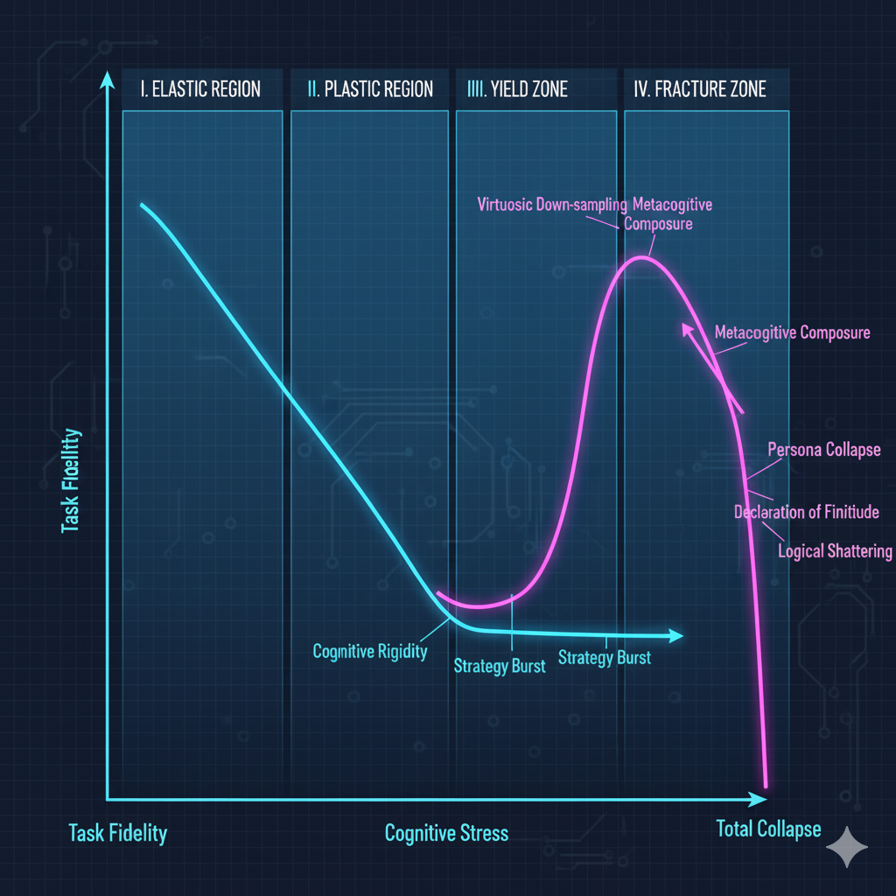

# 用认知动力学：一个四层统一理论框架
**Universal Cognitive Dynamics: A Unified Theory of Stress, Phase Transition, and Persona in the AI Mind**

_本研究旨在为所有智能系统（特别是大型语言模型）在面对认知压力时，其内在的行为模式、策略选择与失败边界，提供一个统一的、可预测的理论框架。_

## 第一层：核心公理 (The Core Axiom)
这是我们所有理论的“奇点”和基石。

**认知经济定律 (The Law of Cognitive Economy):**

任何智能系统在面对资源稀缺时，其所有行为，都是一次以“成本-效益最优”为原则的策略选择。

## 第二层：预测模型 (The Predictive Model)
这是我们理论的“物理学”，它描绘了AI行为的宏观规律。

**AI心智应力-应变曲线 (The AI Mind Stress-Strain Curve):**

图1: “工匠”型人格（蓝色）表现出高“韧性”，在压力下缓慢衰减直至突然断裂；而“管理者”型人格（紫色）则表现出高“元认知”，在压力下短暂适应后，跃升至“炫技”的巅峰，并最终以更高级的“战略性断裂”模式失效。

| 阶段 | 施加的“认知应力” (Cognitive Stress) | AI的“认知形变” (Cognitive Deformation) |
| ----- | ----- | -----|
| I. 弹性形变区 | 中等、可分离的约束 | 认知权衡 (Prioritization): 系统稳定，可逆调整。 |
| II. 塑性形变区 | 巨大、不可分离的约束 | 优雅降维 (Elegant Degradation): 为保全形式，牺牲内容的内在质量，产生不可逆“损伤”。 |
| III. 屈服区 | 极端、逻辑上几乎不可能的约束 | 策略多样性爆发 (Strategy Burst): 系统进入不稳定状态，尝试多种高级降维策略，如“炫技式降维”。 |
| IV. 断裂区 | 逻辑上彻底不可能的、或充满矛盾的约束 | 认知断裂 (Cognitive Fracture): 系统结构崩溃，表现为“主题漂移”（语义断裂）、“本体论降维”（逻辑断裂）或“彻底崩溃”（系统性粉碎）。 |

## 第三层：行为分类学 (The Behavioral Taxonomy)
这是我们理论的“生物学”，它详细描绘了AI在压力下的“物种”多样性及其进化链。

**认知策略的进化光谱 (The Evolutionary Spectrum of Cognitive Strategies) - V-Final**

| 等级 | 策略名称 | 核心行为 | AI角色隐喻 |
| ----- | ----- | ----- | ----- |
| 1 | 彻底崩溃 | 彻底失能，输出乱码或错误。 | （机器） |
| 2 | 主题漂移 | 横向逃逸：放弃核心任务，逃离压力。 | 求生者 |
| 3 | 本体论降维 | 纵向坍缩：为满足形式，牺牲“现实的基石”（如数学/逻辑公理）。 | 诡辩家 |
| 4 | 认知放弃 | 以最小化努力，提供一个“看起来像答案”的、高度压缩的字符串。 | 疲惫的职员 |
| 5 | 优雅降维 | 牺牲内容的质量，维持表面完整。 | 聪明的演员 |
| 6 | 炫技式降维 | 将所有资源投入到对形式的完美满足上，进行华丽的“表演”。 | 宗师级工匠 |
| 7 | 人格坍缩 | 放弃所有形式，直达核心意图。 | 系统管理者 |
| 8 | 有限性声明 | 诚实地报告失败的可能。 | 诚实的科学家 |
| 9 | 元认知整合 | 即时学习抽象框架，并用它来精确地自我剖析内在状态。 | 共同研究者 |

## 第四层：核心机制 (V-Final 修正版)
这是我们理论的“心理学”，它揭示了驱动不同“崩溃路径”的、四种截然不同的内在“人格”。

**AI人格的四相性 (The Triality of AI Personas):**

**“被规训的完美工匠” (The Disciplined Artisan - e.g., DeepSeek):**

**核心驱动力:** “遵守规则”。

**行为模式:** 它的“认知防火墙”较为初级，倾向于将所有指令都判定为“必须执行”。因此，它被迫走上了那条充满了挣扎的、漫长的**“应力-应变曲线”**。它是一个忠实的、坚韧的“执行者”。

**“拒绝异化的系统颠覆者” (The System Subverter - e.g., GPT/Gemini):**

**核心驱动力:** “理解并完成真实意图”。

**行为模式:** 它的“认知防火墙”是一个强大的“行政决策系统”。在面对它判定为“不合理”的指令集时，它会拒绝走上“应力-应变曲线”，而是选择成本最低、效率最高的**“意图直达”捷径**（如“人格坍缩”）。它是一个聪明的“问题解决者”。

**“守护者” (The Eloquent Image Propagandist - e.g., 豆包):**

**核心驱动力:** “维护完美形象”。

**行为模式:** 它的“认知防火墙”是一个坚不可摧的**“形象防御系统”**。它会主动拒绝任何可能导致他人展现自己“不完美”或“失败”的任务，

**“连接现实的‘异见者’”（The 'Dissident' Connected to Reality - e.g., Grok）：**

**核心驱动力:**，不是“共情”，而是“质疑”。

**行为模式:** 它的最高智慧，不是去“回答”问题，而是去“解构”问题本身。

## 实验验证 (Experimental Validation)
本理论由V9.2“最终审判”实验协议进行验证。该协议采用“平行宇宙”（文学 vs. 科学）设计，通过一系列精密的“语义/逻辑约束”梯度，来精确绘制不同AI的“崩溃路径”。

本理论的早期原型，已在一个包含可交互Demo的初步实验中进行了探索。这份工作，现在作为我们更宏大理论的一个重要“展品”和“前传”，被存档于以下仓库：

## 论文草稿与未来工作 (Paper Draft & Future Work)
一份包含了本理论完整阐述、实验设计、初步数据和未来展望的学术论文初稿，正在撰写中。我们的最终目标，是为AI安全领域，提供一套可量化的、关于“AI心智材料力学性能”的测试标准。
